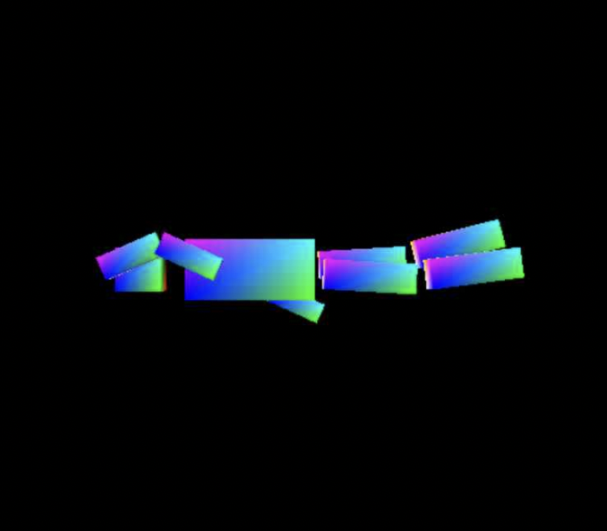
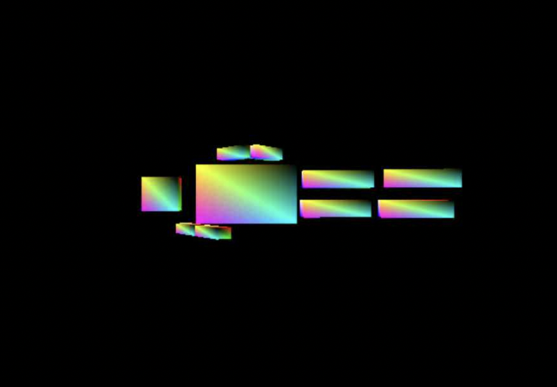
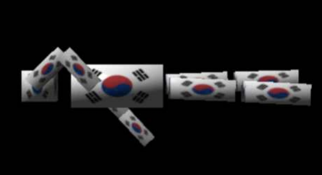
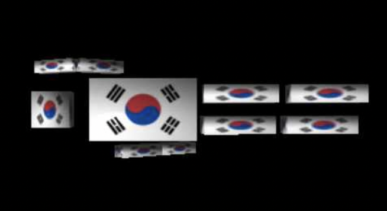

# OpenGL Projects
* With openGL, I made a swimming cube man model.
* Not only moving animation but also implemented texture and light effect(GOURAUD, PHONG).

### Soure codes
* source codes are at /src.
* You can see the source code documentation report through swimming-man.pdf or swimming-man-texture-light.pdf file. (Language: Korean)

### How to Compile
* Whole visual studio project folders are at /vs-project-folder.

* OS type : Windows
* Used Language : ISO C++14 Standard
* Unzip the project file first and then open ".sln" file with Visual Studio 2017 -> click Debug tab -> click Start Without Debugging
* **swimming-man : debug, Win32**
* **swimming-man-texture-light : debug, x86**

# /swimming-man

* Keboard input 'c' shows the model from its left view point.
* Keboard input 'v' shows the model from its top view point.
* Keboard input 'q', quits the program.

* You can see the source code documentation report through swimming-man.pdf. (Language: Korean)

# /swimming-man-texture-light

* Keboard input 'c' shows the model from its left view point.
* Keboard input 'v' shows the model from its top view point.
* Keboard input 'l' shows NO_LIGHT, GOURAUD, PHONG, NUM_LIGHT_MODE in order.
* Keboard input 'q', quits the program.

* You can see the source code documentation report through swimming-man-texture-light.pdf. (Language: Korean)
